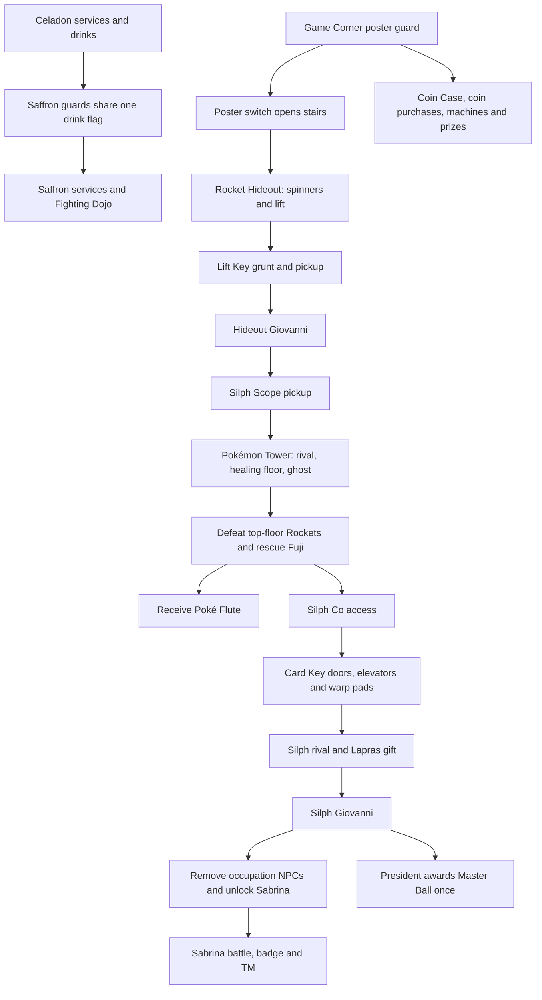

# City and Team Rocket event implementation map

Planning baseline: September 14, 2026, after the medicine/daycare/bicycle fixes.
This is an implementation checklist, not a claim of completed campaign support.

| Area | Existing foundation | Work and acceptance checks |
| --- | --- | --- |
| Earlier cities | Starter/story handlers, gyms through Erika, marts, Centers, daycare, bicycle | Reward ownership survives reload; full bags/parties do not lose rewards; no repeat payouts or duplicate gifts |
| Celadon | City/interiors and Game Corner are cooked | Drinks, Coin Case, coin balance, purchases/prizes; poster guard departure and persistent stair opening |
| Rocket Hideout | Imported maps, trainers, hidden key/scope objects | Include maps; spinner motion, lift destinations/key gate, boss access, win-only flags and visible pickups |
| Lavender/Tower | Only 1F cooked; higher floors imported | Include floors; rival, healing zone, Scope/ghost gate, top-floor Rockets, Fuji rescue and Flute |
| Saffron | Imported but not cooked | Drink gates, occupation visibility, ordinary services, Dojo leader and mutually exclusive gift |
| Silph Co | Imported floors, trainers, key and warp pads | Include floors/elevator; persistent Card Key doors, rival, nurse, Lapras, Giovanni and President reward |
| Saffron Gym | Imported map/trainers | Access follows liberation; warp navigation; Sabrina badge/TM awarded once |
| Other later cities | Outside the through-Erika checkpoint | Fuchsia/Safari/Surf/Strength, Cinnabar/Mansion/key, Viridian final gym, League remain a separate follow-on chapter |
| Passive ability | User clarification pending | Define whether this means Pokémon battle abilities or passive world behavior before changing battle balance |

Implementation order:

1. Centralize event prerequisites, reward ownership and object visibility; fix repeat/full-bag cases in existing handlers.
2. Add and test the Game Corner/Hideout chain, including map geometry and travel requirements.
3. Add and test Tower rescue and Saffron admission.
4. Add and test Silph liberation, Dojo and Sabrina.
5. Add the clarified passive feature, then build/package and update the public progress report.

Required validation: controller-triggered events; loss/cancel paths; bag/party capacity;
map re-entry and save/load; topology checks using actual collision/warp data;
PSP build and package validation. Physical PSP acceptance must be reported separately.
