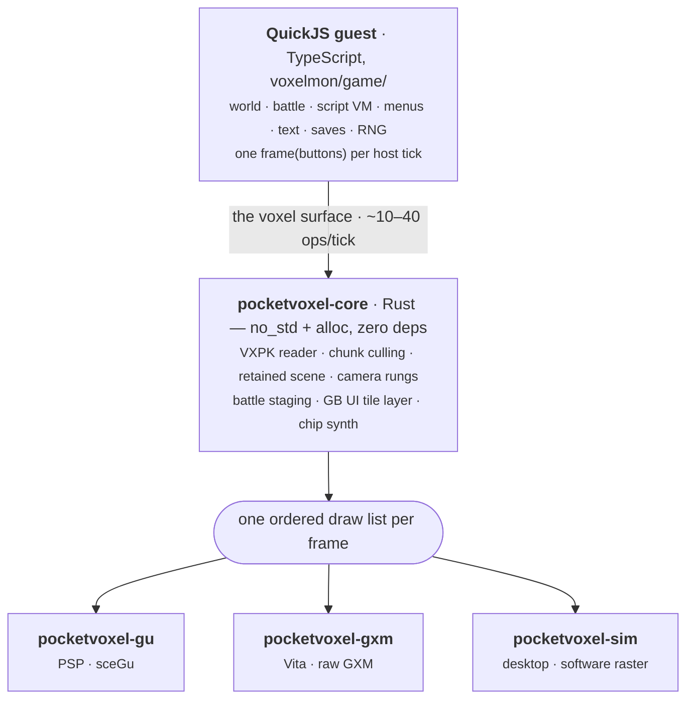

# Architecture

Pocket Voxel is a specialized runtime of
[PocketJS](https://github.com/pocket-stack/pocketjs): the composition is
`⟨ pocketvoxel-core, the voxel surface, the voxelmon guest ⟩`. What makes it
unusual among PocketJS runtimes is that the ownership split is **inverted**:
the game state lives in the guest, and the Rust core owns only the
presentation.

Pocket Mon put world+battle in Rust and authored content in TypeScript.
Pocket Voxel puts world+battle in TypeScript and gives Rust the scene — the
same relationship a retained-mode UI surface has with its guest, applied to a
3D diorama.

## The guest owns the game

The entire [gen1recomp](https://github.com/bryanthaboi/gen1recomp) gameplay
surface, ported module-for-module with the Lua as executable spec: fixed
60 Hz step, edge-per-step input, map loading and connections, grid movement
and collision (bottom-left-tile rule), ledges, warps, doors, NPC wander and
scripted moves, trainer sight, encounters, the script runner and its verbs,
text pagination, menus, party/bag/save, and the battle engine — damage, crit,
accuracy, type chart, status, catch, exp. **Each formula carries a provenance
citation to the Lua it ports.**

The guest owns the RNG and the save. One guest turn per host tick:
`frame(buttons)`, exactly once. The same code runs headless in Bun (for the
sim and tests) and inside QuickJS on device — the module graph is
transport-clean by design and bundles to a single IIFE (`game.js`).

## The core owns the scene

`pocketvoxel-core` is presentation only, zero gameplay. It is `no_std +
alloc`, `f32` (libm on PSP), zero dependencies. Per frame it:

- loads the VXPK and owns chunk meshes **zero-copy in place**, culling per
  frame with a frustum over chunk AABBs;
- retains what the guest drives through ops: camera, pitch rung, tint, up to
  16 entity billboards, removable stamps, emotes, the battle stage, and a
  retained GB UI tile grid (20×18) with a reveal counter for typewriter text;
- resolves every textured draw's CLUT through one function,
  `draw::resolve_pal` — the pak's per-map world palette, then the page's own
  palette, then the `palette` op's SGB selection, then the page kind's GB
  ramp. **Both hardware backends and the software rasterizer call the same
  function**, so no two renderers can bind different colours for one draw;
- builds one ordered draw list: sky bands → terrain chunks (each followed by
  its own tree mesh at this rung's level of detail) → water → shadow decals →
  player ghost (inverted depth, no write) → entity cards → grass → flowers →
  GB UI quads.

Backends consume that list and never touch list lifecycle. Adding a machine
means adding a backend, **not forking the game** — the Vita port is a second
backend and a second shell around the same core, same pak, same guest bundle.

## The boundary is thin, and measured

Steady-state traffic is **~10–40 ops per tick** (camera + moving entities + a
text reveal counter); opening a menu bursts a few hundred `ui*` ops once.
Against the measured QuickJS wall on a 333 MHz PSP — **~1.7 µs per op, ~8k
ops per frame** — that is noise.

Data crosses once, at boot: `gamedata()` returns the pak's GAME section
(one cold JSON parse guest-side, then the guest never crosses for data
again), and `audiodata()` returns the AUDI manifest's JSON half. The op
vocabulary itself is pinned in `contracts/spec/voxel-spec.ts`, code-generated
into Rust, and a **byte-compare drift guard** fails the build if the two ever
disagree — see [The Voxel Surface](/reference/surface).

## Audio: names in the guest, bytes in the core

Sound is the ROM's own **channel programs** — short bytecode streams the GB
sound driver interprets frame by frame. Pocket Voxel runs them in an
interpreter in the Rust core (`pocketvoxel-core/src/audio.rs`, a port of
gen1recomp's `ChipSynth.lua`) that renders straight to PCM. No register-level
emulation: the interpreter tracks note, envelope, duty, vibrato, slide, sweep
and noise LFSR per channel, and the four channels sum, divide by four and
clamp.

The split follows the runtime's one rule — **the guest owns names, the core
owns bytes**:

- `game/audio/banks.ts` resolves a song label, sfx name or species into the
  numbers an audio op carries. `bank` is a *bank slot* — the ROM bank's index
  in the manifest's `bankOrder` — and `addr` the program's GB address inside
  its 0x4000-byte window.
- `pocketvoxel-core/src/audio.rs` reads the program bytes in place out of the
  pak's AUDI section. **The core parses no JSON and knows no name; the guest
  reads no sample.**

Why it lives core-side: measured on real hardware, one PCM frame of the
interpreter cost **~0.21 ms in QuickJS** — 11.025 kHz wanted ~2.3 seconds of
CPU per second of audio, collapsing the frame to ~9 fps. Compiled, the same
interpreter renders a whole tick's 184 frames in ~6.5 µs on a desktop —
extrapolated, **~2% of the 16.7 ms frame** on the PSP's Allegrex instead of
230% of it.

Correctness is held to a hard bar: rendered PCM is verified **sample-exact**
against the unmodified reference `ChipSynth.lua` running under LuaJIT — all
45 songs, 104 sound effects and 154 cries, ~200 million samples, zero
differences. PCM leaves through the PocketJS `audio` module, not through the
voxel surface; a host that pumps nothing runs the identical op stream silent.

## Where to go deeper

- The full design record, with every measurement and every rejected
  alternative: [VOXEL.md](/VOXEL)
- How the pak gets made: [The Asset Pipeline](/guide/pipeline)
- How one pak serves three machines: [The Quality Ladder](/guide/quality-ladder)
- The op vocabulary: [The Voxel Surface](/reference/surface)
