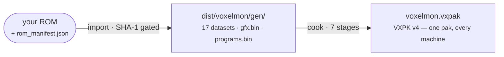

# The Asset Pipeline

Everything a machine renders comes out of one cooked file,
`dist/voxelmon/voxelmon.vxpak`. The pipeline that produces it runs on your
machine, once — the VoxelMod's analysis at cook time instead of every session
on the handheld:



## Import: manifest-driven, SHA-1 gated

`bun tools/voxel.ts import` is a TypeScript port of the gen1recomp extractor,
driven by the same `rom_manifest.json` (3274 name→[bank,addr] symbol entries,
charmap, per-map metadata). It is **manifest-driven, not offset-hardcoded** —
the manifest is consumed verbatim rather than transcribing a megabyte of
addresses. The SHA-1 gate runs before anything is decoded.

What comes out, under `dist/voxelmon/gen/`:

- **17 JSON datasets** with the same field names and record shapes as the Lua
  tables, so parity diffing is mechanical (`maps.json`, `pokemon.json`,
  `moves.json`, `encounters.json`, `text.json`, …).
- **`gfx.bin`** — one blob of indexed bitmaps, 1 byte per pixel (`0..3` = GB
  shade, `0xff` = transparent), with `gfx.json` as its directory. Graphics
  never become PNGs in `gen/`.
- **`programs.bin`** — the ROM's sound banks concatenated in `bankOrder`,
  0x4000 bytes each: the windows the chip-synth interpreter reads through.

Parity with the reference is testable, not assumed: the gen1recomp checkout's
own Python extractor produces the same datasets independently, and
`bun tools/voxel.ts parity` deep-compares all 16 datasets that have a
reference counterpart, field for field. See
[Data & Formats](/reference/formats) for shapes and normalization rules.

## Cook: the voxelizer

`bun tools/voxel.ts cook` runs seven stages (`voxelmon/cook/`):

1. **Classify** every tile position — profile pins → cell rules → wall
   fallback; the VoxelMod's class/height table ported verbatim
   (`classify.ts`).
2. **Measure volumes** — repeat-aware column heights, region consensus, roof
   split — then match the 42 building templates and place pinned props
   (`volumes.ts`, `buildings.ts`).
3. **Mesh per 16×16-tile chunk** into GE-ready buffers: 16-byte vertices
   (u16 fixed-point UVs, u32 colour, i16 positions), u16 indices, face shade
   × baked AO folded into vertex colour, grass/flower/water split into their
   own meshes, side faces cut into 8 px bands with cropped — never
   stretched — art. Round scenery is meshed **three times**: the fine carved
   hull, the same drawing carved at 2×2-px voxels (`treeCoarse`), and the
   cells re-extruded as plain boxes (`treeBox`) — the levels the
   [quality ladder](/guide/quality-ladder) picks between at runtime.
4. **Pack atlases** as pre-swizzled CLUT8 — one terrain-atlas copy per
   animation frame (water, flowers), so tile animation on device is a texture
   bind, not a texel write. Day tint is a CLUT rewrite — the GB's own trick.
5. **Bake RED++ colour** into the terrain page's texel index and resolve the
   per-map/per-page bindings (`redpp.ts`, below).
6. **Drop the faces no camera can reach** (the hidden-face cull, below).
7. **Write the pak** — a MONPAK-style container: magic, section table,
   16-byte alignment, validated zero-copy reader core-side. Sections carry
   the chunks, atlases, palettes, colour bindings, the GAME section the guest
   parses at boot, and the AUDI section with `audio.json` + `programs.bin`
   verbatim. Layout details: [Data & Formats](/reference/formats).

Determinism is a pipeline property: **two cooks of the same inputs are
byte-identical.**

## The hidden-face cull

Every quad the cooker emits names the direction its front points in, and one
rule decides what no camera can reach: **-Y faces (undersides) topping out at
or below 24 world px are dropped.** A downward face is front-facing only when
the eye is under it, and eye height depends on the camera rig alone, never on
where the player stands — the lowest rig eye is 27.91 px.

Measured effect: **5.2% of cooked quads and 4.6% of the pak** removed, with
all 15 hash goldens byte-identical. `VOXEL_KEEP_HIDDEN=1` re-cooks a
byte-identical pre-cull pak, which is how the rule is A/B'd.

Two neighbouring ideas were measured and **rejected, and stay rejected**:
north-facing walls are visible in the southern half of a top-down frame, and
the camera-ward pull means grass/flower quads' cooked facing is not their
drawn facing — culling either breaks goldens.

::: warning The cull is a pak invariant
Anything that lowers a camera eye below 24 px — a new rig, a smaller rig
height, a sixth pitch rung — **invalidates the cooked pak**, not just the
cooker. A free-roam camera deletes this optimisation; it does not work around
it.
:::

## Per-tile colour (RED++ / pokered-gbc)

pokered-gbc assigns one of 8 four-colour palettes to every tile graphic id of
a tileset, swapping only the ROOF slot per town. The reference reaches those
colours by CPU-recolouring the tileset atlas per map; Pocket Voxel reaches
the same colours **without recolouring anything**, by moving the palette
group into the texel index:

```text
texel = group * 4 + shade     // 0..31
0xff  = transparent           // unchanged
```

8 groups × 4 shades = 32 of the CLUT's 256 entries, so the entire per-tile
assignment fits inside the byte the page already stored: **zero delta** in
page dimensions, texel count, fill rate, vertex count, draw calls and guest
ops. Pallet Town's white roofs and Viridian's green roofs share one terrain
page and cost one CLUT load each. The roof swap replaces only colours 1 and 2
of the ROOF group, exactly as the GB's `LoadTownPalette` does.

Parity is claimed **at the CLUT, not at the framebuffer** (baked AO × face
shade means no pixel can match a flat 2D reference): the test runs
gen1recomp's own `PaletteFX` under LuaJIT and compares all 2688 resolved
colours against the cook. Where the reference model can't apply — per-map
tile-id exceptions on a shared terrain page — the cooker **refuses to cook**
rather than mis-colouring silently.

## Cook-time flags

| Flag | Effect |
| --- | --- |
| `VOXEL_KEEP_HIDDEN=1` | keep the culled undersides — the A/B switch for the hidden-face rule |
| `VOXEL_TREE_BOXES=1` | carve nothing; boxes ride the terrain stream (the pre-LOD shape; such a pak renders its one tree level at every rung) |

The pak states what it carries: a META flags word says whether chunks hold
both tree levels, and the chunk record's extra mesh ranges bumped the VXPK
version (3 → 4), so a stale pak is **rejected instead of mis-read**.
